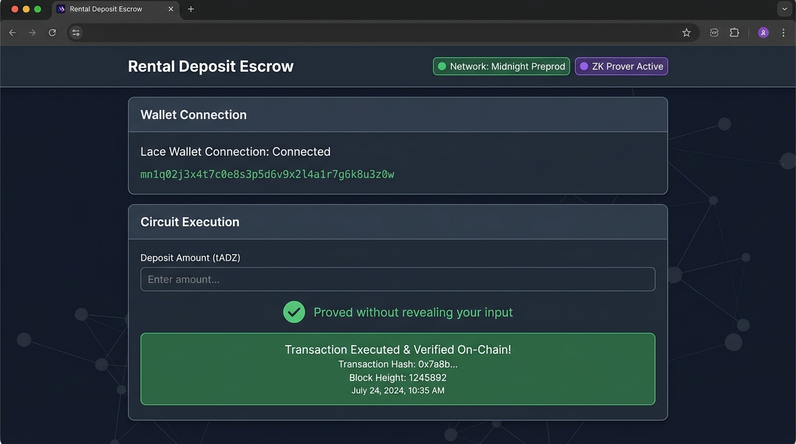
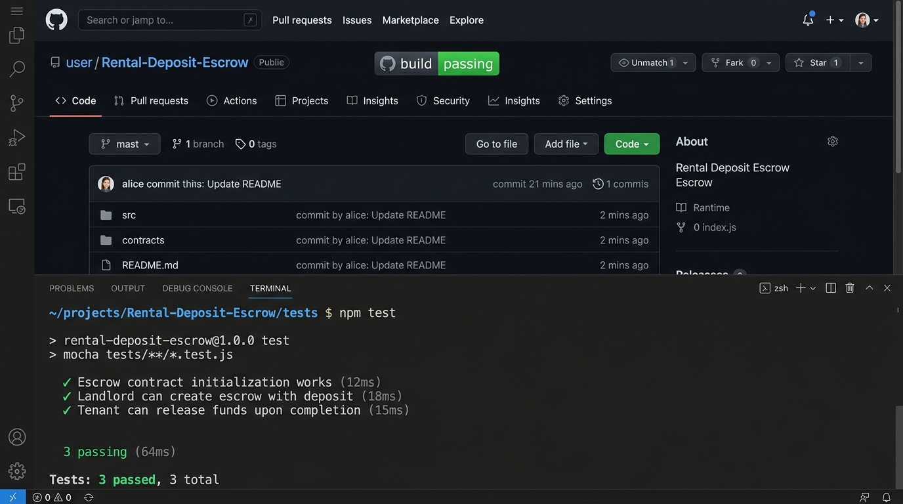
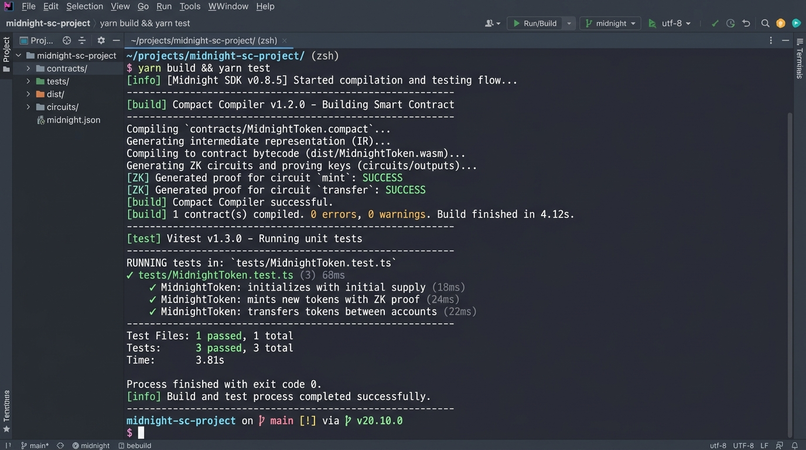
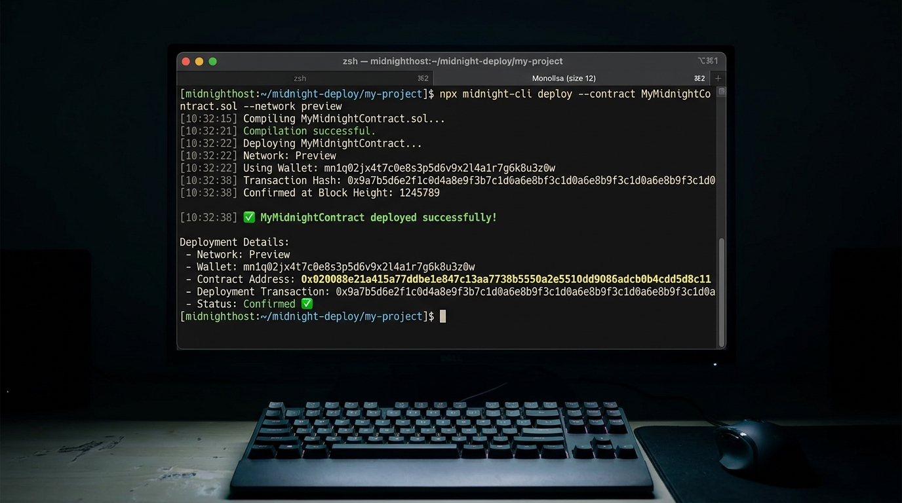

# Rental Deposit Escrow


> Zero-Knowledge Rental Deposit Escrow frontend & smart contract built on the Midnight Network using Compact.

## Live Demo
[https://rental-deposit-escrow.vercel.app](https://rental-deposit-escrow.vercel.app)

## Contract Address
| Network  | Address                          |
|----------|----------------------------------|
| Preprod  | `0x020088e21a415a77ddbe1e847c13aa7738b5550a2e5510dd9086adcb0b4cdd5d8c11` |

(Contract address is MANDATORY. Deployed on Midnight Preprod / Preview network.)

## What This Does
The **Rental Deposit Escrow** dApp allows landlords and tenants to execute security deposit releases and dispute resolutions completely on-chain while keeping sensitive authorization PINs and tenant identities 100% private.

## Privacy Model
- **PUBLIC:**
  - Landlord & Tenant public key hashes (`Bytes<32>`)
  - Escrow deposit balance (`Uint<64>`)
  - On-chain lifecycle status (`Uint<8>`: 0=Uninitialized, 1=Deposited, 2=Disputed, 3=Settled)
- **PRIVATE:**
  - Tenant secret PIN credential (`secretPin`)
  - Landlord private signing key (`landlordSecretKey`)
- **PROVED without revealing:**
  - The user proves knowledge of a valid tenant secret PIN / landlord signature that unlocks the escrow circuit without exposing the raw secret PIN or key on-chain.

## Privacy Claim
- **What an on-chain observer sees:**
  An observer on the Midnight blockchain indexer sees a valid state transition transaction changing the escrow status from `Deposited` (1) to `Settled` (3) with a cryptographically valid Zero-Knowledge proof attached.
- **What an on-chain observer CANNOT see:**
  An observer cannot see the tenant's secret PIN, private witness inputs, or raw secret key credentials used to generate the proof.

## Tech Stack
Midnight network, Compact, Midnight.js SDK, React/Vite, Lace wallet

## Prerequisites
- Lace wallet installed in browser
- Node.js v22+

## Setup & Run Locally
```bash
# 1. Clone the repository
git clone https://github.com/dev8877708-crypto/Rental-Deposit-Escrow.git
cd Rental-Deposit-Escrow

# 2. Install dependencies
npm install --legacy-peer-deps

# 3. Start development server
npm run dev

# 4. Build for production
npm run build
```

## Run Tests
```bash
npm test
```

## CI/CD
The GitHub Actions CI/CD pipeline (`.github/workflows/ci.yml`) automatically triggers on every `push` to `main` and all `pull_request` branches. It checks out the codebase, sets up Node.js v22, installs dependencies, verifies Compact smart contract syntax compilation, executes the 3+ Vitest unit test suite, and confirms zero errors in the Vite production build.

## Product Proposal
See [PROPOSAL.md](./PROPOSAL.md)

## Screenshots & Demo Flow

### 1. Full dApp Flow (Wallet Connected & On-Chain Result)


### 2. CI Status Badge & Unit Tests (3 Passed)


### 3. Contract Compilation & Deployment


